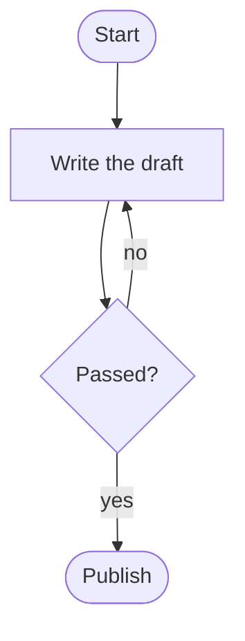

# How a post is published

```mermaid
flowchart TD
  s1(["Start"])
  s2["Write the draft"]
  s3{"Passed?"}
  s4(["Publish"])
  s1 --> s2
  s2 --> s3
  s3 -->|"yes"| s4
  s3 -->|"no"| s2
```

Remember the deadline
